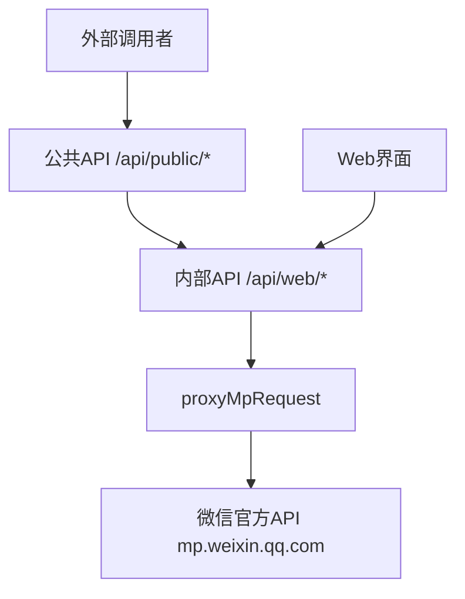

## API构建方式详解

本项目的API**不是基于微信官方API的二次开发**，而是作为**代理层**转发请求到微信官方API。项目通过代理微信公众号后台的现有功能来实现数据获取。

### API架构层次



### 1. 代理核心机制

所有API请求最终都通过 `proxyMpRequest` 函数转发到微信官方API： [1](#2-0) 

该函数设置必要的请求头（Referer、Origin、User-Agent）模拟微信后台环境： [2](#2-1) 

### 2. 内部API - 直接代理

内部API直接代理微信官方接口：

**公众号搜索API** - 代理到 `https://mp.weixin.qq.com/cgi-bin/searchbiz` [3](#2-2) 

**文章列表API** - 代理到 `https://mp.weixin.qq.com/cgi-bin/appmsgpublish` [4](#2-3) 

**评论API** - 代理到 `https://mp.weixin.qq.com/mp/appmsg_comment` [5](#2-4) 

### 3. 公共API - 封装层

公共API提供简化的接口供外部调用，但底层仍依赖内部API：

**账号搜索** (`/api/public/v1/account`) 调用内部搜索接口： [6](#2-5) 

**文章列表** (`/api/public/v1/article`) 同样使用内部API获取数据

**文章下载** (`/api/public/v1/download`) 直接抓取文章页面，不依赖API： [7](#2-6) 

### 4. 特殊接口实现

**主体信息查询** (`/api/public/beta/aboutbiz`) 直接请求微信API并解析HTML： [8](#2-7) 

**作者信息** (`/api/public/beta/authorinfo`) 代理到微信作者信息接口： [9](#2-8) 

### 5. 认证机制

项目通过auth-key机制管理微信会话，所有需要认证的请求都会自动注入微信cookies： [10](#2-9) 

## 项目与微信API的关系

- **非二次开发**：项目没有创建新的API端点或修改微信API行为
- **功能代理**：所有数据都来自微信公众号后台的现有功能
- **核心原理**：利用公众号后台"搜索其他公众号文章"功能获取数据 [11](#2-10) 
- **价值添加**：提供会话管理、数据缓存、批量导出等功能

项目的创新点在于简化了微信数据的获取流程，提供了统一的API接口和丰富的导出功能，而不是创造了新的数据获取方式。

## Notes

- 部分beta接口（如`/api/public/v1/download`）不需要认证 [12](#2-11) 
- 所有API请求都会自动添加微信必要的请求头和cookies
- 项目承诺不会将用户账号用于公共爬池 [13](#2-12) 

Wiki pages you might want to explore:
- [Troubleshooting (wechat-article/wechat-article-exporter)](/wiki/wechat-article/wechat-article-exporter#10.3)
- [Backend APIs (wechat-article/wechat-article-exporter)](/wiki/wechat-article/wechat-article-exporter#7)
- [Internal API Endpoints (wechat-article/wechat-article-exporter)](/wiki/wechat-article/wechat-article-exporter#7.2)

### Citations

**File:** server/utils/proxy-request.ts (L14-58)
```typescript
export async function proxyMpRequest(options: RequestOptions) {
  const runtimeConfig = useRuntimeConfig();

  const headers = new Headers({
    Referer: 'https://mp.weixin.qq.com/',
    Origin: 'https://mp.weixin.qq.com',
    'User-Agent': USER_AGENT,
  });

  // 优先读取参数中的 cookie，若无则从 CookieStore 中读取
  const cookie: string | null = options.cookie || (await getCookieFromStore(options.event));
  if (cookie) {
    headers.set('Cookie', cookie);
  }

  const requestInit: RequestInit = {
    method: options.method,
    headers: headers,
    redirect: options.redirect || 'follow',
  };

  // 处理参数
  if (options.query) {
    options.endpoint += '?' + new URLSearchParams(options.query as Record<string, string>).toString();
  }
  if (options.method === 'POST' && options.body) {
    requestInit.body = new URLSearchParams(options.body as Record<string, string>).toString();
  }

  // 构造请求
  const request = new Request(options.endpoint, requestInit);

  // 记录请求报文
  const requestId = uuidv4().replace(/-/g, '');
  if (process.env.NUXT_DEBUG_MP_REQUEST && isDev) {
    await logRequest(requestId, request.clone());
  }

  // 转发请求
  const mpResponse = await fetch(request);

  // 记录响应报文
  if (process.env.NUXT_DEBUG_MP_REQUEST && isDev) {
    await logResponse(requestId, mpResponse.clone());
  }
```

**File:** server/api/web/misc/comment.get.ts (L29-35)
```typescript
  const resp: Response = await proxyMpRequest({
    event: event,
    method: 'GET',
    endpoint: 'https://mp.weixin.qq.com/mp/appmsg_comment',
    query: params,
    parseJson: false,
  });
```

**File:** server/api/public/v1/download.get.ts (L42-48)
```typescript
  const rawHtml = await fetch(url, {
    headers: {
      Referer: 'https://mp.weixin.qq.com/',
      Origin: 'https://mp.weixin.qq.com',
      'User-Agent': USER_AGENT,
    },
  }).then(res => res.text());
```

**File:** server/api/public/beta/aboutbiz.get.ts (L22-29)
```typescript
  const rawHtml = await fetch(`https://mp.weixin.qq.com/mp/aboutbiz?${new URLSearchParams(query).toString()}`, {
    method: 'GET',
    headers: {
      'User-Agent': USER_AGENT,
      'x-wechat-uin': process.env.NUXT_WECHAT_ABOUT_BIZ_UIN || '',
      'x-wechat-key': key || process.env.NUXT_WECHAT_ABOUT_BIZ_KEY || '',
    },
  }).then(resp => resp.text());
```

**File:** server/api/public/beta/authorinfo.get.ts (L22-28)
```typescript
  return proxyMpRequest({
    event: event,
    method: 'GET',
    endpoint: 'https://mp.weixin.qq.com/mp/authorinfo',
    query: params,
    parseJson: true,
  }).catch(e => {
```

**File:** README.md (L61-63)
```markdown
## :bulb: 原理

在公众号后台写文章时支持搜索其他公众号的文章功能，以此来实现抓取指定公众号所有文章的目的。
```

**File:** README.md (L72-74)
```markdown
本程序承诺，不会利用您扫码登录的公众号进行任何形式的私有爬虫，也就是说不存在把你的账号作为公共账号为别人爬取文章的行为，也不存在类似账号池的东西。

您的公众号只会服务于您自己的抓取文章的目的。
```

**File:** config/public-apis.ts (L284-284)
```typescript
    remark: '此接口不需要 API 密钥',
```
