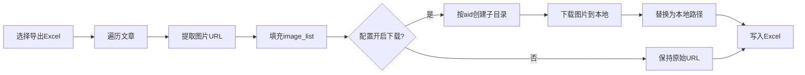

## 实现方案

### 1. 导出 CSV（含作者 ID、正文、图片链接等）
- 复用 `ExcelExportEntity` 数据结构（已包含作者ID、内容、封面/图片链接等字段） [1](#0-0) 。
- 参考 `exportExcelFiles` 的数据准备逻辑，遍历文章并填充字段（包括 `_accountName`、`content`、`cover` 等） [2](#0-1) 。
- 将数据转为 CSV 字符串（处理逗号/换行转义），用 `Blob` + `saveAs` 下载（类似 `export2JsonFile`） [3](#0-2) 。

### 2. 提取图片链接
- 使用 `extractResources` 从文章 HTML 中提取所有图片 URL（`img[src]`、`img[data-src]`、背景图） [4](#0-3) 。
- 将图片 URL 存入 CSV 的“图片链接”字段（多图可用分号或 JSON 数组）。

### 3. 下载图片
- 对每个图片 URL，调用 `downloadResourceTask` 通过代理下载（支持重试与缓存） [5](#0-4) 。
- 也可直接用 URL 下载（无需代理时）。

### 4. 完整流程


## 代码示例（关键步骤）

- 数据准备（复用 Excel 导出逻辑）：
  ```ts
  const data: ExcelExportEntity[] = [];
  for (const url of urls) {
    const article = await getArticleByLink(url);
    const accountName = await getAccountNameByFakeid(article.fakeid);
    const content = await this.getPureContent(url, 'text', parser);
    const metadata = await getMetadataCache(url);
    data.push({ ...article, _accountName: accountName, content, ...metadata });
  }
  ``` [6](#0-5) 

- 提取图片链接：
  ```ts
  const resources: string[] = [];
  const imgs = document.querySelectorAll('img');
  for (const img of imgs) {
    const imgUrl = img.getAttribute('src') || img.getAttribute('data-src');
    if (imgUrl) resources.push(imgUrl);
  }
  ``` [7](#0-6) 

- 导出 CSV（参考 JSON 导出）：
  ```ts
  const csv = convertToCSV(data); // 需实现转义逻辑
  const blob = new Blob([csv], { type: 'text/csv;charset=utf-8' });
  saveAs(blob, `${filename}.csv`);
  ``` [3](#0-2) 

- 下载图片：
  ```ts
  for (const url of resources) {
    await this.downloadResourceTask(url, fakeid); // 代理下载
    // 或直接 fetch(url) 下载
  }
  ``` [5](#0-4) 

## Notes
- 项目暂无原生 CSV 导出，需基于现有 Excel/JSON 导出扩展。
- 图片链接提取已支持 `src`、`data-src` 和背景图正则匹配。
- 下载图片支持代理池与重试，适合批量下载。
- CSV 需自行处理字段转义（逗号、换行、引号）。

Wiki pages you might want to explore:
- [Content Processing Pipeline (wechat-article/wechat-article-exporter)](/wiki/wechat-article/wechat-article-exporter#6)

### Citations

**File:** utils/exporter.ts (L8-13)
```typescript
export type ExcelExportEntity = AppMsgEx &
  Partial<ArticleMetadata> & {
    content?: string;
    comments?: any[];
    _accountName: string | null;
  };
```

**File:** utils/exporter.ts (L73-77)
```typescript
// 导出为 json 文件
export async function export2JsonFile(data: ExcelExportEntity[], filename: string) {
  const blob = new Blob([JSON.stringify(data)], { type: 'application/json' });
  saveAs(blob, `${filename}.json`);
}
```

**File:** utils/download/Exporter.ts (L91-149)
```typescript
  // 提取出 html 中的子资源，并保存在 resource-map 表中
  private async extractResources(): Promise<void> {
    const parser = new DOMParser();

    for (const url of this.urls) {
      const article = await getArticleByLink(url);
      if (!article) {
        continue;
      }

      const cached = await getHtmlCache(url);
      if (!cached) {
        console.warn(`文章(url: ${url} )的 html 还未下载，不能导出`);
        continue;
      }

      const html = await cached.file.text();
      const document = parser.parseFromString(html, 'text/html');

      // 该 html 内部的资源，包括图片、背景图片、样式
      const resources: string[] = [];

      // 提取图片地址
      const imgs = document.querySelectorAll<HTMLImageElement>('img');
      for (const img of imgs) {
        const imgUrl = img.getAttribute('src') || img.getAttribute('data-src');
        if (imgUrl) {
          resources.push(imgUrl);
          this.resources.add({ url: imgUrl, fakeid: article.fakeid });
        }
      }

      // 提取样式地址
      const links = document.querySelectorAll<HTMLLinkElement>('link[rel="stylesheet"]');
      for (const link of links) {
        const url = link.href;
        if (url) {
          resources.push(url);
          this.resources.add({ url: url, fakeid: article.fakeid });
        }
      }

      // 提取背景图片地址
      html.replaceAll(
        /((?:background|background-image): url\((?:&quot;)?)((?:https?|\/\/)[^)]+?)((?:&quot;)?\))/gs,
        (_, p1, url, p3) => {
          resources.push(url);
          this.resources.add({ url: url, fakeid: article.fakeid });
          return `${p1}${url}${p3}`;
        }
      );

      await updateResourceMapCache({
        fakeid: article.fakeid,
        url: url,
        resources: resources,
      });
    }
  }
```

**File:** utils/download/Exporter.ts (L183-216)
```typescript
  // 下载资源任务
  private async downloadResourceTask(url: string, fakeid: string): Promise<void> {
    this.pending.add(url);

    // 检查缓存是否可用，避免重复下载相同资源
    const cached = await getResourceCache(url);
    if (cached) {
      this.pending.delete(url);
      this.completed.add(url);
      return;
    }

    for (let attempt = 0; attempt < this.options.maxRetries; attempt++) {
      const proxy = this.proxyManager.getBestProxy();

      try {
        const blob = await this.download(fakeid, url, proxy);
        await updateResourceCache({
          fakeid: fakeid,
          url: url,
          file: blob,
        });
        this.pending.delete(url);
        this.completed.add(url);
        this.proxyManager.recordSuccess(proxy);
        return;
      } catch (error) {
        await this.handleDownloadFailure(proxy, url, attempt, error);
      }
    }

    this.pending.delete(url);
    this.failed.add(url);
  }
```

**File:** utils/download/Exporter.ts (L218-250)
```typescript
  // 导出 excel 文件
  private async exportExcelFiles(): Promise<void> {
    const total = this.urls.length;
    this.emit('export:total', total);

    const parser = new DOMParser();
    const data: ExcelExportEntity[] = [];

    for (let i = 0; i < total; i++) {
      const url = this.urls[i];
      console.debug(`(${i + 1}/${total})开始导出: ${url}`);

      const article = await getArticleByLink(url);
      const accountName = await getAccountNameByFakeid(article.fakeid);
      const exportedArticle: ExcelExportEntity = { ...article, _accountName: accountName };
      if (preferences.value.exportConfig.exportExcelIncludeContent) {
        exportedArticle.content = await this.getPureContent(url, 'text', parser);
      }
      const metadata = await getMetadataCache(url);
      if (metadata) {
        exportedArticle.readNum = metadata.readNum;
        exportedArticle.oldLikeNum = metadata.oldLikeNum;
        exportedArticle.shareNum = metadata.shareNum;
        exportedArticle.likeNum = metadata.likeNum;
        exportedArticle.commentNum = metadata.commentNum;
      }
      data.push(exportedArticle);

      this.emit('export:progress', i + 1);
    }

    await export2ExcelFile(data, '微信公众号文章');
  }
```

## 实现路径规划

### 1. 扩展导出数据结构
- 在 `ExcelExportEntity` 中增加 `image_list?: string[]` 字段用于存储图片链接数组（或本地相对路径） [1](#1-0) 。

### 2. 提取图片链接并填充
- 在 `exportExcelFiles` 遍历文章时，调用类似 `extractResources` 的逻辑提取当前文章的所有图片 URL（`img[src]`、`img[data-src]`、背景图） [2](#1-1) 。
- 将提取的图片 URL 数组赋值给 `exportedArticle.image_list` [3](#1-2) 。

### 3. 配置项控制下载
- 在 `ExportConfig` 增加布尔开关 `exportExcelDownloadImages: boolean`，默认 false [4](#1-3) 。
- 在导出设置页面增加对应勾选框 [5](#1-4) 。

### 4. 图片下载与目录组织
- 若开启下载，在 `exportExcelFiles` 中对每篇文章的 `image_list` 执行下载：
  - 使用 `downloadResourceTask` 下载单个图片（支持代理与重试） [6](#1-5) 。
  - 用 `writeFile` 将图片写入 `images/${article.aid}/` 子目录，文件名可用 URL hash 或序号 [7](#1-6) 。
  - 可将 `image_list` 替换为本地相对路径（如 `images/${aid}/xxx.jpg`）以便离线访问。

### 5. Excel 列定义
- 在 `export2ExcelFile` 的列定义中增加 `{ header: '图片列表', key: 'image_list', width: 50 }`，写入时用 `;` 或换行连接数组 [8](#1-7) 。

### 6. 完整流程示意


## 关键代码示例

- 扩展类型（utils/exporter.ts）：
  ```ts
  export type ExcelExportEntity = AppMsgEx &
    Partial<ArticleMetadata> & {
      content?: string;
      comments?: any[];
      _accountName: string | null;
      image_list?: string[]; // 新增
    };
  ```

- 提取并填充（Exporter.exportExcelFiles）：
  ```ts
  const resources: string[] = [];
  const imgs = document.querySelectorAll('img');
  for (const img of imgs) {
    const imgUrl = img.getAttribute('src') || img.getAttribute('data-src');
    if (imgUrl) resources.push(imgUrl);
  }
  exportedArticle.image_list = resources;
  ```

- 下载到子目录（Exporter）：
  ```ts
  if (preferences.value.exportConfig.exportExcelDownloadImages) {
    for (const imgUrl of exportedArticle.image_list || []) {
      const blob = await this.downloadResourceTask(imgUrl, article.fakeid);
      const filename = imgUrl.split('/').pop() || 'image';
      await this.writeFile(`images/${article.aid}/${filename}`, blob);
    }
  }
  ```

- Excel 列（utils/exporter.ts）：
  ```ts
  worksheet.columns = [
    // ...现有列
    { header: '图片列表', key: 'image_list', width: 50 },
  ];
  ```

## Notes
- 图片下载逻辑可复用现有的 `downloadResourceTask` 与 `writeFile`，确保代理与重试机制生效。
- 目录名使用文章 aid（文章ID）可保证唯一性，与现有 `exportDirName` 中的 `${aid}` 变量一致 [9](#1-8) 。
- 若图片数量大，建议在配置中增加并发控制或仅导出链接不下载，以避免性能问题。

Wiki pages you might want to explore:
- [Article Synchronization (wechat-article/wechat-article-exporter)](/wiki/wechat-article/wechat-article-exporter#5.3)

### Citations

**File:** utils/exporter.ts (L8-13)
```typescript
export type ExcelExportEntity = AppMsgEx &
  Partial<ArticleMetadata> & {
    content?: string;
    comments?: any[];
    _accountName: string | null;
  };
```

**File:** utils/exporter.ts (L21-41)
```typescript
  // 设置表头
  worksheet.columns = [
    { header: '公众号', key: '_accountName', width: 20 },
    { header: 'ID', key: 'aid', width: 20 },
    { header: '链接', key: 'link', width: 50 },
    { header: '标题', key: 'title', width: 80 },
    { header: '封面', key: 'cover', width: 50 },
    { header: '摘要', key: 'digest', width: 50 },
    { header: '创建时间', key: 'create_time', width: 20 },
    { header: '发布时间', key: 'update_time', width: 20 },
    { header: '阅读', key: 'readNum', width: 10 },
    { header: '点赞', key: 'oldLikeNum', width: 10 },
    { header: '分享', key: 'shareNum', width: 10 },
    { header: '喜欢', key: 'likeNum', width: 10 },
    { header: '留言', key: 'commentNum', width: 10 },
    { header: '作者', key: 'author_name', width: 20 },
    { header: '是否原创', key: 'copyright', width: 10 },
    { header: '文章类型', key: 'item_show_type', width: 20 },
    { header: '所属合集', key: 'album', width: 50 },
    { header: '文章内容', key: 'content' },
  ];
```

**File:** utils/download/Exporter.ts (L91-149)
```typescript
  // 提取出 html 中的子资源，并保存在 resource-map 表中
  private async extractResources(): Promise<void> {
    const parser = new DOMParser();

    for (const url of this.urls) {
      const article = await getArticleByLink(url);
      if (!article) {
        continue;
      }

      const cached = await getHtmlCache(url);
      if (!cached) {
        console.warn(`文章(url: ${url} )的 html 还未下载，不能导出`);
        continue;
      }

      const html = await cached.file.text();
      const document = parser.parseFromString(html, 'text/html');

      // 该 html 内部的资源，包括图片、背景图片、样式
      const resources: string[] = [];

      // 提取图片地址
      const imgs = document.querySelectorAll<HTMLImageElement>('img');
      for (const img of imgs) {
        const imgUrl = img.getAttribute('src') || img.getAttribute('data-src');
        if (imgUrl) {
          resources.push(imgUrl);
          this.resources.add({ url: imgUrl, fakeid: article.fakeid });
        }
      }

      // 提取样式地址
      const links = document.querySelectorAll<HTMLLinkElement>('link[rel="stylesheet"]');
      for (const link of links) {
        const url = link.href;
        if (url) {
          resources.push(url);
          this.resources.add({ url: url, fakeid: article.fakeid });
        }
      }

      // 提取背景图片地址
      html.replaceAll(
        /((?:background|background-image): url\((?:&quot;)?)((?:https?|\/\/)[^)]+?)((?:&quot;)?\))/gs,
        (_, p1, url, p3) => {
          resources.push(url);
          this.resources.add({ url: url, fakeid: article.fakeid });
          return `${p1}${url}${p3}`;
        }
      );

      await updateResourceMapCache({
        fakeid: article.fakeid,
        url: url,
        resources: resources,
      });
    }
  }
```

**File:** utils/download/Exporter.ts (L183-216)
```typescript
  // 下载资源任务
  private async downloadResourceTask(url: string, fakeid: string): Promise<void> {
    this.pending.add(url);

    // 检查缓存是否可用，避免重复下载相同资源
    const cached = await getResourceCache(url);
    if (cached) {
      this.pending.delete(url);
      this.completed.add(url);
      return;
    }

    for (let attempt = 0; attempt < this.options.maxRetries; attempt++) {
      const proxy = this.proxyManager.getBestProxy();

      try {
        const blob = await this.download(fakeid, url, proxy);
        await updateResourceCache({
          fakeid: fakeid,
          url: url,
          file: blob,
        });
        this.pending.delete(url);
        this.completed.add(url);
        this.proxyManager.recordSuccess(proxy);
        return;
      } catch (error) {
        await this.handleDownloadFailure(proxy, url, attempt, error);
      }
    }

    this.pending.delete(url);
    this.failed.add(url);
  }
```

**File:** utils/download/Exporter.ts (L218-250)
```typescript
  // 导出 excel 文件
  private async exportExcelFiles(): Promise<void> {
    const total = this.urls.length;
    this.emit('export:total', total);

    const parser = new DOMParser();
    const data: ExcelExportEntity[] = [];

    for (let i = 0; i < total; i++) {
      const url = this.urls[i];
      console.debug(`(${i + 1}/${total})开始导出: ${url}`);

      const article = await getArticleByLink(url);
      const accountName = await getAccountNameByFakeid(article.fakeid);
      const exportedArticle: ExcelExportEntity = { ...article, _accountName: accountName };
      if (preferences.value.exportConfig.exportExcelIncludeContent) {
        exportedArticle.content = await this.getPureContent(url, 'text', parser);
      }
      const metadata = await getMetadataCache(url);
      if (metadata) {
        exportedArticle.readNum = metadata.readNum;
        exportedArticle.oldLikeNum = metadata.oldLikeNum;
        exportedArticle.shareNum = metadata.shareNum;
        exportedArticle.likeNum = metadata.likeNum;
        exportedArticle.commentNum = metadata.commentNum;
      }
      data.push(exportedArticle);

      this.emit('export:progress', i + 1);
    }

    await export2ExcelFile(data, '微信公众号文章');
  }
```

**File:** utils/download/Exporter.ts (L862-880)
```typescript
  public async writeFile(path: string, file: Blob): Promise<void> {
    const segment = path.split('/');
    const filename = segment[segment.length - 1];
    let directory = this.exportRootDirectoryHandle!;
    if (segment.length > 1) {
      // 创建目录
      for (const name of segment.slice(0, -1)) {
        directory = await directory.getDirectoryHandle(name, { create: true }).catch(e => {
          console.warn(`路径(${path})(${name})中包含非法字符，不能作为文件系统的路径名`);
          throw e;
        });
      }
    }
    const fileHandle = await directory.getFileHandle(filename, { create: true });
    // @ts-ignore
    const writable = await fileHandle.createWritable();
    await writable.write(file);
    await writable.close();
  }
```

**File:** utils/download/Exporter.ts (L882-907)
```typescript
  // 确定导出文件的目录名
  private async exportDirName(articleUrl: string): Promise<string> {
    let dirnameTpl = (preferences.value as Preferences).exportConfig.dirname;
    const maxlength = (preferences.value as Preferences).exportConfig.maxlength;

    const article = await getArticleByLink(articleUrl);
    const articleUpdateTime = dayjs.unix(article.update_time);
    const account = this.allAccountInfo.find(account => account.fakeid === article.fakeid);
    if (account && account.nickname) {
      dirnameTpl = dirnameTpl.replace(/\$\{account}/g, filterInvalidFilenameChars(account.nickname));
    }

    dirnameTpl = dirnameTpl.replace(/\$\{title}/g, filterInvalidFilenameChars(article.title));
    dirnameTpl = dirnameTpl.replace(/\$\{aid}/g, article.aid);
    dirnameTpl = dirnameTpl.replace(/\$\{author}/g, article.author_name);
    dirnameTpl = dirnameTpl.replace(/\$\{YYYY}/g, articleUpdateTime.format('YYYY'));
    dirnameTpl = dirnameTpl.replace(/\$\{MM}/g, articleUpdateTime.format('MM'));
    dirnameTpl = dirnameTpl.replace(/\$\{DD}/g, articleUpdateTime.format('DD'));
    dirnameTpl = dirnameTpl.replace(/\$\{HH}/g, articleUpdateTime.format('HH'));
    dirnameTpl = dirnameTpl.replace(/\$\{mm}/g, articleUpdateTime.format('mm'));

    if (maxlength) {
      return dirnameTpl.slice(0, maxlength);
    }
    return dirnameTpl;
  }
```

**File:** types/preferences.d.ts (L25-43)
```typescript
interface ExportConfig {
  // 目录名格式
  dirname: string;

  // 目录最大长度
  maxlength: number;

  // 导出json中是否包含文章内容
  exportJsonIncludeContent: boolean;

  // 导出json中是否包含评论
  exportJsonIncludeComments: boolean;

  // 导出excel中是否包含文章内容
  exportExcelIncludeContent: boolean;

  // 导出html中是否包含评论
  exportHtmlIncludeComments: boolean;
}
```

**File:** components/setting/Export.vue (L61-67)
```vue
      <div>
        <UCheckbox
          v-model="preferences.exportConfig.exportExcelIncludeContent"
          name="exportExcelIncludeContent"
          label="导出 Excel 中包含文章内容"
        />
      </div>
```
